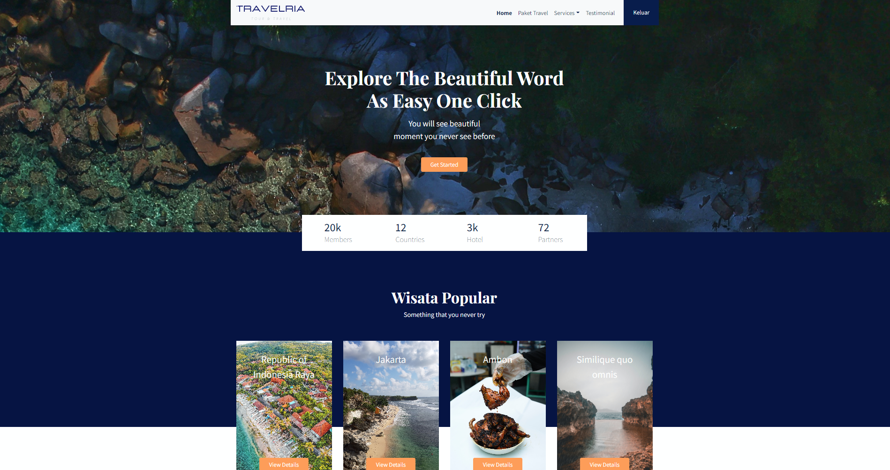

# Travelling

> Simple Website Travelling build using Laravel.
> Live demo [_here_](https://travelindoid.masuk.web.id/). <!-- If you have the project hosted somewhere, include the link here. -->

## Table of Contents

-   [General Info](#general-information)
-   [Technologies Used](#technologies-used)
-   [Screenshots](#screenshots)
-   [Usage](#usage)
-   [Contact](#contact)
<!-- * [License](#license) -->

## General Information

-   This project is a travel package website where users can choose the travel packages available and purchased to be able to travel to the tours provided on this website
-   This website is made to make it easier for tourists to enjoy a good vacation and get to know more about existing tours2
-   this website I created to make it easier for tourists to travel
-   I created this project to add to my portfolio
<!-- You don't have to answer all the questions - just the ones relevant to your project. -->

## Technologies Used

-   Laravel - version 9.19
-   PHP - version 8.0.2
-   Bootstrap - version 4.3.1
-   Javascript/JQuery - version 3.6.0
-   Gigjlo - version 2.0.0
-   AnimatedScroll JS - version 1.0.7
-   Retina JS - version 1.3.0
-   X-Zoom JS - version 1.0.15

## Screenshots



<!-- If you have screenshots you'd like to share, include them here. -->

## Usage

How does one go about using it?

```
$ cd ../yout project path
$ composer install
$ php artisan storage:link
$ php artisan migrate
$ php artisan serve
```

and then go to this url 127.0.0.1:8000 or localhost:8000.

## Project Status

Project is: _Complete_

## Contact

Created by [@billymlelatobur17](http://billyportfolio.masuk.web.id/) - feel free to contact me!

<!-- Optional -->

## License

This project is open source and available under the [... License]().

<!-- You don't have to include all sections - just the one's relevant to your project -->
