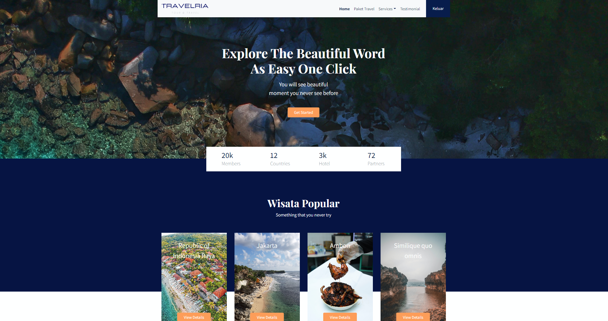

# Travelling
> Simple Website Travelling build using Laravel.
> Live demo [_here_](https://travelindoid.masuk.web.id/). <!-- If you have the project hosted somewhere, include the link here. -->

## Table of Contents
* [General Info](#general-information)
* [Technologies Used](#technologies-used)
* [Screenshots](#screenshots)
* [Usage](#usage)
<!-- * [License](#license) -->

## General Information
- This project is a travel package website where users can choose the travel packages available and purchased to be able to travel to the tours provided on this website
- This website is made to make it easier for tourists to enjoy a good vacation and get to know more about existing tours2
- this website I created to make it easier for tourists to travel
- I created this project to add to my portfolio
<!-- You don't have to answer all the questions - just the ones relevant to your project. -->

## Technologies Used
- Laravel - version 9.19
- PHP - version 8.0.2
- Bootstrap - version 4.3.1
- Javascript/JQuery - version 3.6.0
- Gigjlo - version 2.0.0 
- AnimatedScroll JS - version 1.0.7
- Retina JS - version 1.3.0
- X-Zoom JS - version 1.0.15

## Screenshots

<!-- If you have screenshots you'd like to share, include them here. -->

## Setup
What are the project requirements/dependencies? Where are they listed? A requirements.txt or a Pipfile.lock file perhaps? Where is it located?

Proceed to describe how to install / setup one's local environment / get started with the project.

## Usage
How does one go about using it?
Provide various use cases and code examples here.

`write-your-code-here`

## Project Status
Project is: _in progress_ / _complete_ / _no longer being worked on_. If you are no longer working on it, provide reasons why.

## Room for Improvement
Include areas you believe need improvement / could be improved. Also add TODOs for future development.

Room for improvement:
- Improvement to be done 1
- Improvement to be done 2

To do:
- Feature to be added 1
- Feature to be added 2

## Acknowledgements
Give credit here.
- This project was inspired by...
- This project was based on [this tutorial](https://www.example.com).
- Many thanks to...

## Contact
Created by [@flynerdpl](https://www.flynerd.pl/) - feel free to contact me!

<!-- Optional -->
<!-- ## License -->
<!-- This project is open source and available under the [... License](). -->

<!-- You don't have to include all sections - just the one's relevant to your project -->
